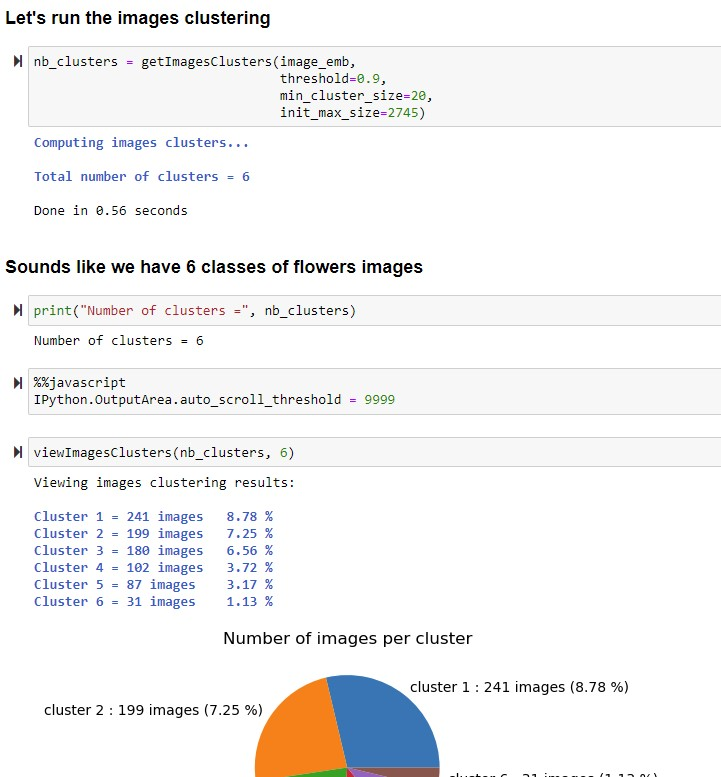

# Images clustering with Sentence Transformers

**SentenceTransformers** provides models that allow to embed images and text into the same vector space. This allows to find similar images as well as to implement image search. We can define a query using text or using a reference image.

In this example we will see how to use Sentence Transformers for **images clustering (grouping unlabeled images is called images clustering like the usual clustering ML modelling).**

 
03-Oct-2022
Serge Retkowsky | serge.retkowsky@microsoft.com | https://www.linkedin.com/in/serger/
